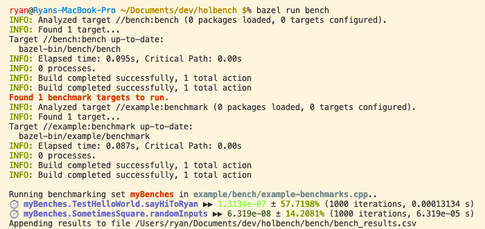

# hol/bench

`hol/bench` is a C++ benchmarking library.  You can use it in any project by including `benc.h`, but if your project is using Bazel you'll get a little more out of it.  The project relies on C++17, but could probably be modified to use an earlier version if needed.


## Usage

Check out [example/bench/example-benchmarks.cpp](example/bench/example-benchmarks.cpp) for some code snippets to learn from.

To use with your Bazel project, copy the directory structure of this project as-is.  You'll want to copy `/bench` into your project as a package, and then use the build target of `/example` as a guide for how you can add benchmarks to any of your packages.

### Running a single benchmark set

```bazel run //example:benchmark```

This will run all benchmarks defined by the specified target and output the results to stdout.  (There are optional command line arguments to outputting to a file, but that's not fully implemented yet.)

### Running all benchmark sets

```bazel run bench```

This will run every target in your project of the form `//*:benchmark` and append their results to `/bench/bench_results.csv`.  Running on the example, your output will look something like this:



### Analysis

The CSV is intended to accumulate multiple runs of the same tests over time.  This is useful so you can track how changes to your code have impacted performance across commits.  A powerful way to do this is to copy-paste the CSV into a Google Sheets, split into columns, and then create a pivot table of mean values for test name vs datetime.  You can also do neat things like graph performance across successive runs over time.

# TODO
Here is a partial list of things left to implement:

- Implement proper argument parsing.  Individual benchmarks currently don't handle datetime and/or appending to an output file well.
- Implement commandline filters for functions, bench sets, etc.
- Find a better naming convention than simply `//*:benchmark` so that packages can have multiple benchmark targets
- Clean up display code